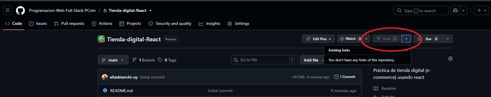

# Tienda-digital-React

Práctica de tienda digital (e-commerce) usando react.

## 1. Iniciar e Instalar

### 1.1 Fork

Cada alumno deberá crear su propia derivación de este repositorio para trabajar.



y clonarlo en su propio equipo.

### 1.2 Inicializar el proyecto React

Dentro del repositorio inicializar el proyecto React.

```sh
pnpm create vite
# > React
# > Javascript
```

- Limpiar estilos `/src/styles.css`, `/src/app.css`
- Limpiar `/src/App.js` (eliminar el html)

```
src/
├─ components/
│  └─ Layout.jsx
├─ contexts/
│  └─ ProductosContext.jsx
├─ pages/ 
│  ├─ Carrito.jsx
│  ├─ Home.jsx
│  └─ Product.jsx
├─ styles.css
├─ App.jsx
└─ main.jsx
```

### 1.3 Instalación de dependencias

- [react-router (declarative mode)](https://reactrouter.com/start/declarative/installation)

## 2. Clases

- [clase 06/07/2026](./clases/CLASE_06072026.MD)

## 3. Utilidades

- [Fake Store Api](https://fakestoreapi.com/docs)
- [React - Hooks, estados y sincronización](https://docs.google.com/presentation/d/19TBGP7ie8EiejvCh9Nyjrjw6moQ9Vyoi3_p9XzQSVR0/edit?slide=id.p#slide=id.p)
- [React - Funciones y métodos comunes](https://docs.google.com/presentation/d/1T3TuTvGGiaIA2NGQD-0co6fm26sEk8jS74eFM-wml14/edit?slide=id.p#slide=id.p)
- [Forks](https://github.com/Programacion-Web-Full-Stack-PCom/Tienda-digital-React/forks)
